<h1>
Proyecto Hals
</h1>

<h2>
Integrantes:
</h2>

*   Brian Camilo Fajardo Sánchez
*   Jaider Arley Gonzalez Arias
*   Miguel Ángel Barrera Díaz
*   Andrea Johana Durán Vivas

<h2>
Curso:
</h2>

Ciclos de Vida del Desarrollo de Software (CVDS)

<h2>
Profesor a cargo:
</h2>
Ivan Dario Lemus Moya

<h2>
Roles:
</h2>

>  **SCRUM Master**

Brian Camilo Fajardo Sánchez

> **Equipo SCRUM**

*   Jaider Arley Gonzalez Arias
*   Miguel Ángel Barrera Díaz
*   Andrea Johana Durán Vivas

> **Product Owner**

Ivan Dario Lemus Moya

> **Code Reviewer**

Jorge David Saenz Díaz

<h2>
Descripción del producto:
</h2>
Las funcionalidades implementadas hasta el momento son:

1. Registro de citas con firma
2. Visualización de citas en un calendario
3. Validación de términos y condiciones
4. Login para el administrador
5. Envío automático del correo electrónico para informar de la asignación de cita

<h2>
Descripción general:
</h2>

1. Página de bienvenida

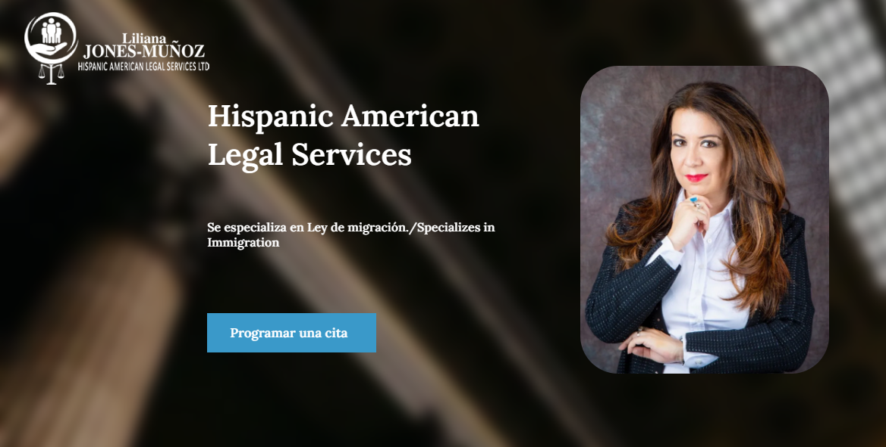

2. Página donde se puede registrar la cita

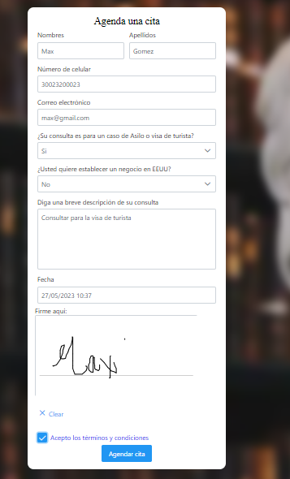

3. Términos y condiciones

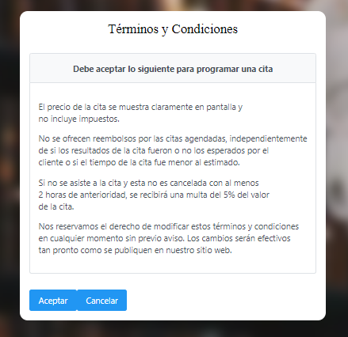

3. Envío del correo electrónico

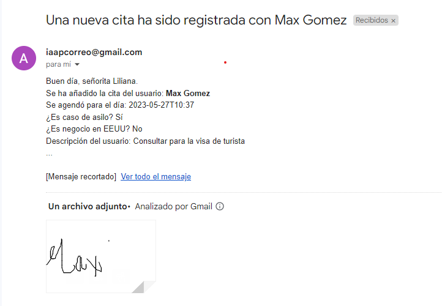

4. Login como administrador

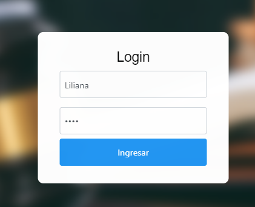

5. Visualización de las citas en un calendario

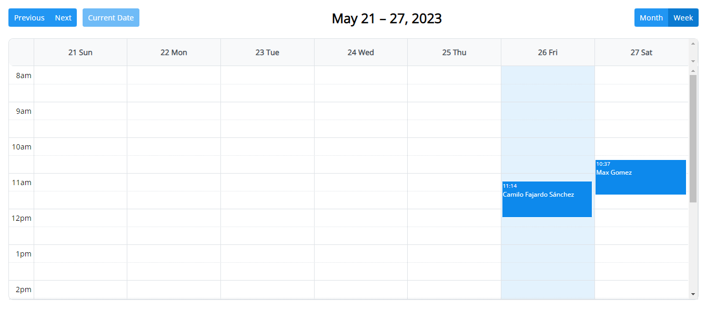

6. Verificar los detalles de la cita

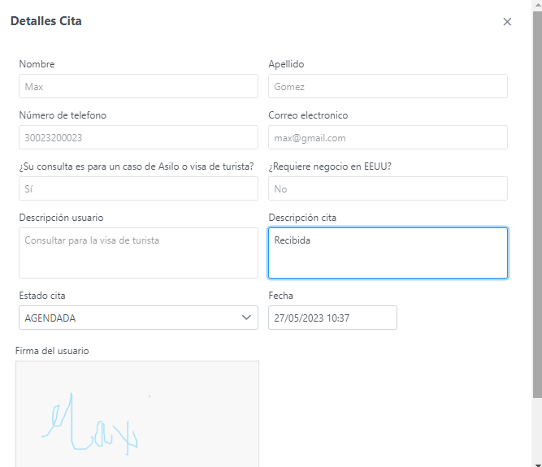

<h2>
Arquitectura y Diseño detallado:
</h2>

> **Modelo E-R**

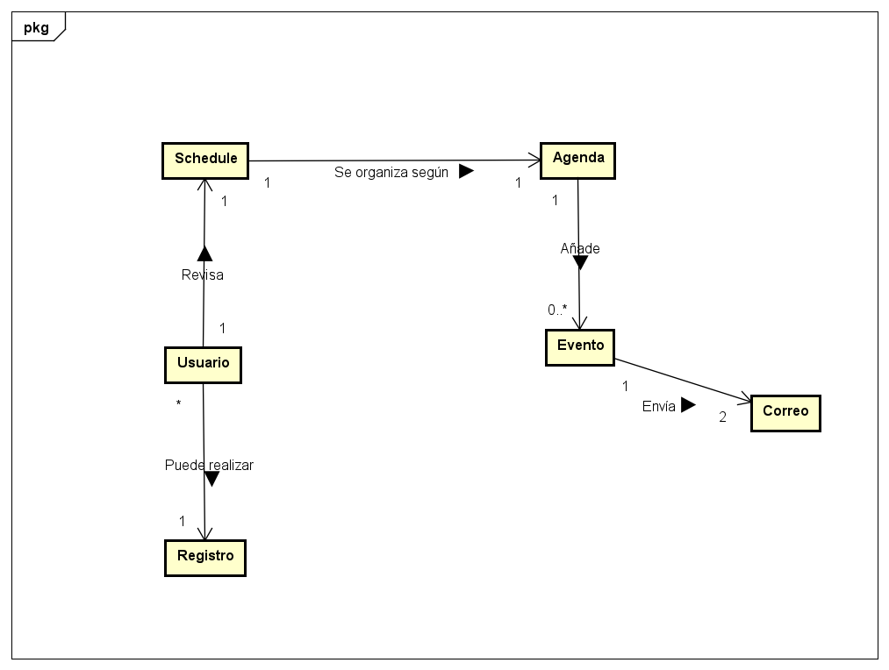

> **Descripción de la arquitectura (capas) y del Stack de tecnologías utilizado**

Para las capas se usaron cuatro principales: controlador, modelo, respositorio y servicio

El siguiente es el diagrama de paquetes (se puede consultar todo el documento del diseño en la carpeta Multimedia CVDS):

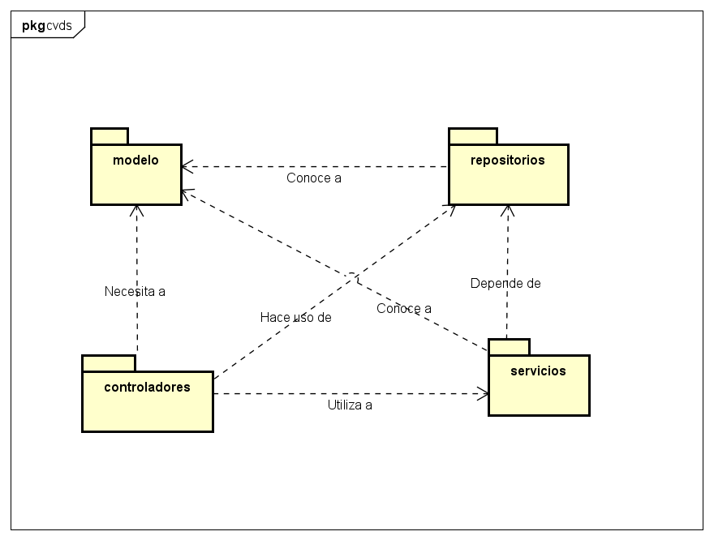
Se usó Azure DevOps para la integración continua del proyecto, y maven y java para el desarrollo del proyecto

> **Diagrama de clases**

1. Paquete controladores

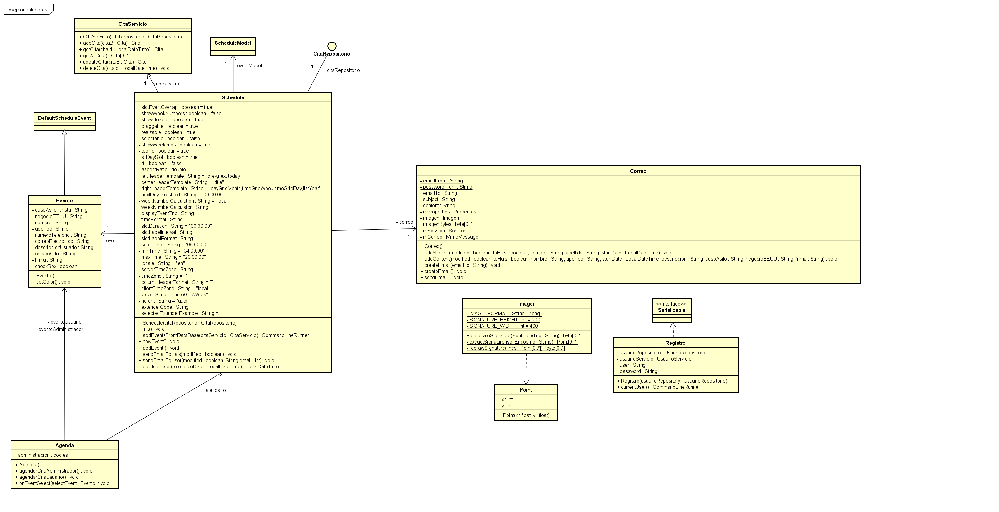

2. Paquete modelos

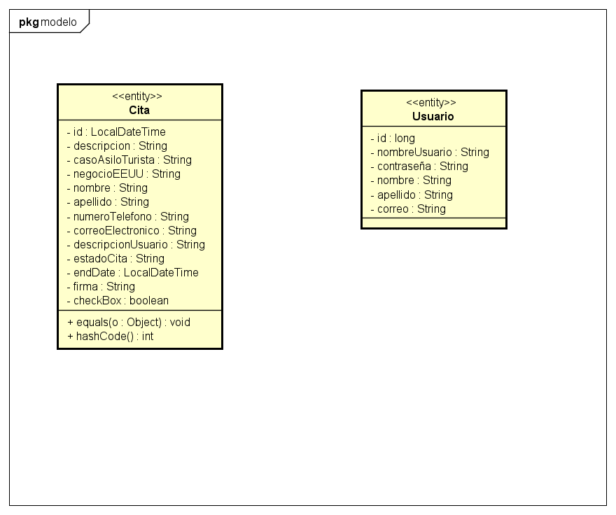

3. Paquete repositorios

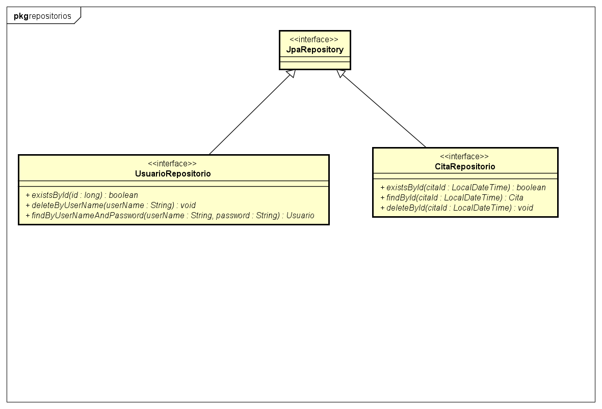

4. Paquete servicios

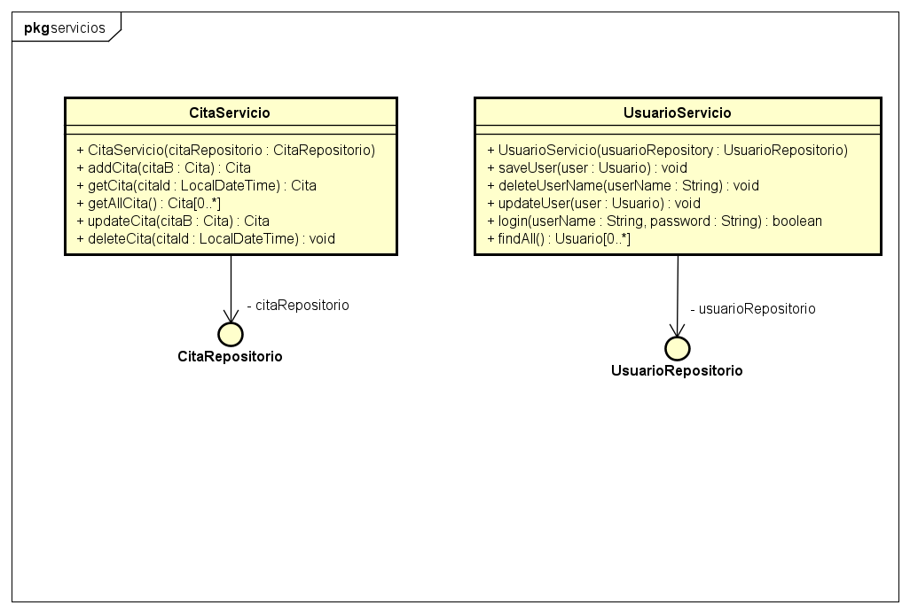

> **Enlace a la aplicación en AzureDevOps.**
Ingreso desde la página de bienvenida: http://halsapp.azurewebsites.net/prj-final-5.1.0/
Ingreso para login del administrador: http://halsapp.azurewebsites.net/prj-final-5.1.0/login/index.xhtml

Para el login las credenciales por defecto son:

Usuario: Liliana
  
Contraseña: 1234

> **Enlace al backlog en AzureDevOps.**
https://dev.azure.com/Arequipitos/HALS/_backlogs/backlog/Arequipitos%20Team/Backlog%20items

<h2>
Descripción del proceso:
</h2>

> **Imagen Sprint Backlog**

1. Sprint 1

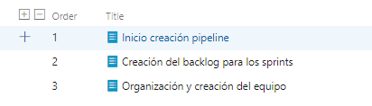

2. Sprint 2

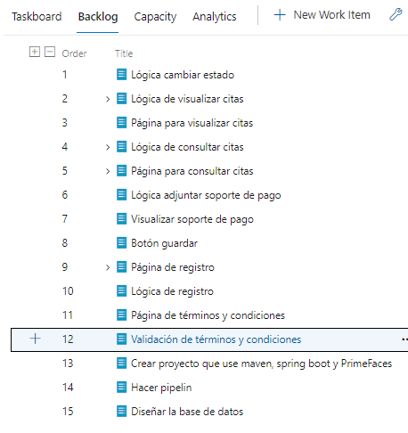

3. Sprint 3

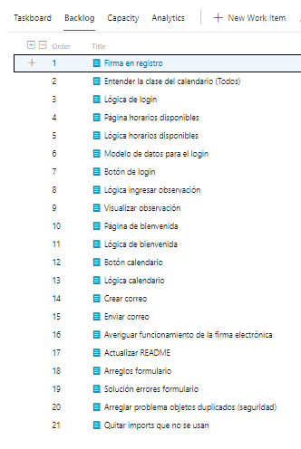

> **Reporte de pruebas y de cubrimiento de las mismas**

